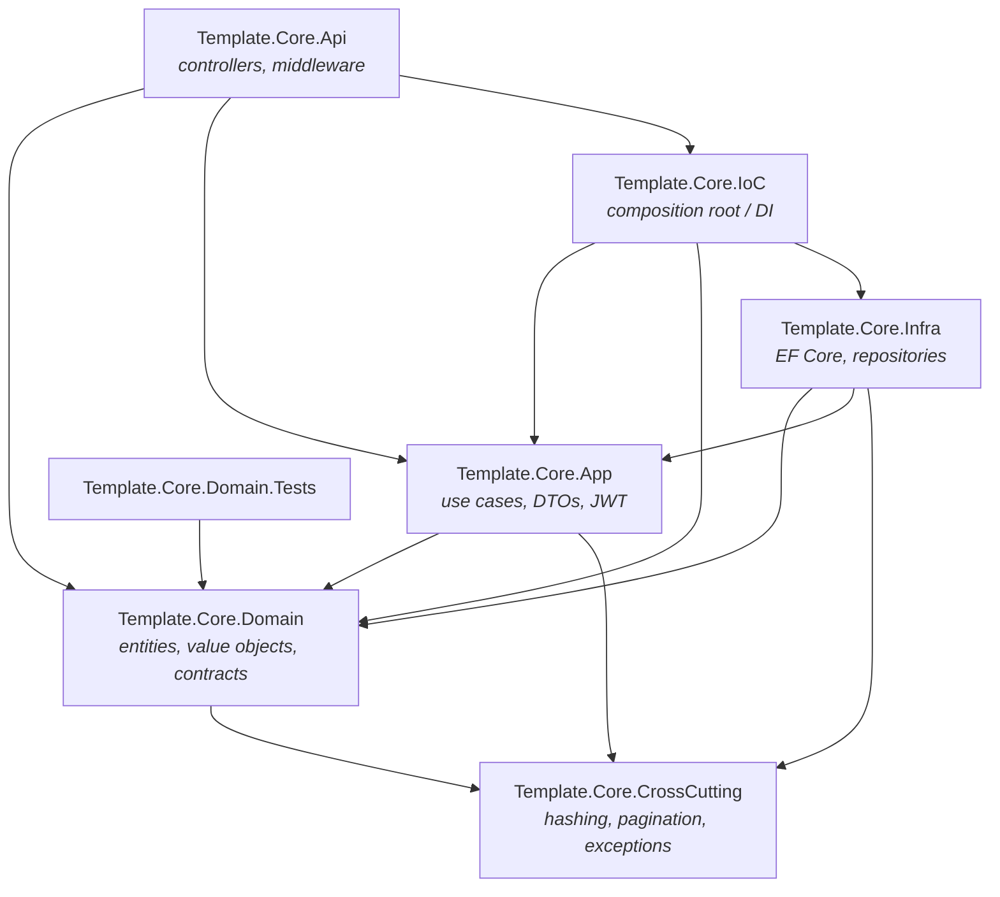
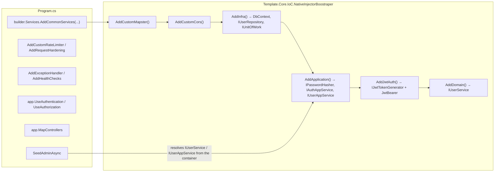
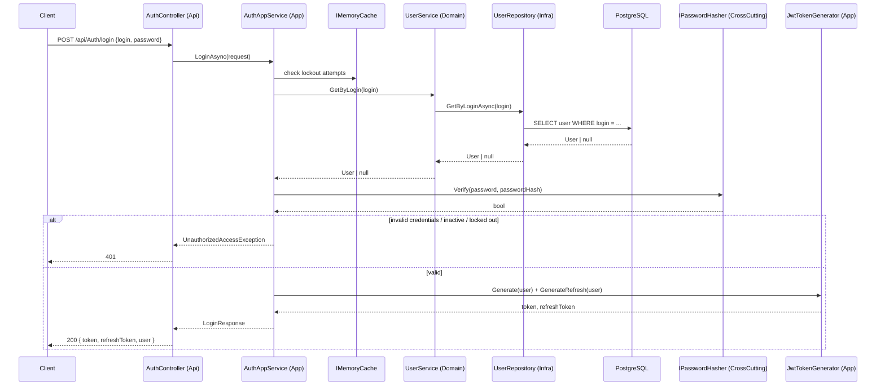
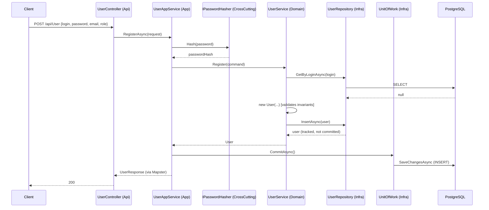

# Template.Core — DDD Architecture

.NET 10 API organized in layers following Domain-Driven Design principles, with dependency
injection centralized in a composition project (`Template.Core.IoC`). The current domain
(the `Users` + `Auth` feature) serves as a living reference for the pattern to replicate for
new contexts.

## Contents

- [Layers](#layers)
- [Project dependency graph](#project-dependency-graph)
- [Dependency rule](#dependency-rule)
- [Application composition (Program.cs → IoC)](#application-composition-programcs--ioc)
- [Request flows](#request-flows)
- [Folder structure](#folder-structure)
- [Tech stack](#tech-stack)
- [Running it](#running-it)

## Layers

| Project | Role | Depends on |
|---|---|---|
| **Template.Core.Domain** | Business core: entities, value objects, enums, commands, repository/domain-service interfaces. Knows nothing about EF Core, HTTP, or DI. | CrossCutting |
| **Template.Core.App** | Use cases (application services), input/output DTOs, transaction orchestration (`IUnitOfWork`), JWT generation. Depends on domain abstractions, never on Infra. | Domain, CrossCutting |
| **Template.Core.Infra** | Persistence implementation: `DbContext` (EF Core + Npgsql), concrete repositories, `UnitOfWork`, entity mappings. | Domain, App*, CrossCutting |
| **Template.Core.CrossCutting** | Utilities shared by every layer: password hashing (BCrypt), pagination, domain exceptions. Depends on nothing else. | — |
| **Template.Core.IoC** | *Composition root*: the only place that knows **every** layer at once. Registers Infra/App/Domain implementations against their interfaces, and configures JWT, CORS, Serilog, the database, Scalar/Swagger, and the initial admin seed. | App, Domain, Infra |
| **Template.Core.Api** | HTTP presentation layer: controllers, middleware, rate-limit/hardening configuration. Only sees App/Domain interfaces — never references Infra directly; the concrete wiring happens through IoC. | Domain, App, IoC |
| **Template.Core.Domain.Tests** | Domain unit tests (xUnit v3 + NSubstitute). | Domain |

\* `Infra → App` is the only break in the otherwise strictly one-directional Domain→App→Infra
flow: it exists because `IUnitOfWork` is declared in `App/Common` (the transaction contract used
by application services) and implemented in `Infra/Common/UnitOfWork.cs` on top of the `DbContext`.

## Project dependency graph



## Dependency rule

- **CrossCutting** depends on nothing — it's the base layer.
- **Domain** only knows CrossCutting. It never references App, Infra, IoC, or Api.
- **App** orchestrates use cases using only Domain contracts (`IUserService`, `IUserRepository`,
  etc.) and CrossCutting (`IPasswordHasher`). It never references Infra.
- **Infra** implements the contracts defined in Domain/App using EF Core + Npgsql (PostgreSQL). It
  is the only layer that knows the database exists.
- **IoC** is the only project that references Infra while also being referenced by the Api — it's
  the one that does `services.AddScoped<IUserRepository, UserRepository>()`, wiring the abstraction
  to its implementation.
- **Api** never imports `Template.Core.Infra` directly (it isn't a `ProjectReference` in its
  `.csproj`); it only resolves services through dependency injection, configured by IoC at startup.

This chain means swapping the persistence provider (e.g., Postgres → another database) would only
require changes in Infra plus the IoC bootstrap — Domain, App, and Api stay untouched.

## Application composition (Program.cs → IoC)



`AddCommonServices` (called once from `Program.cs`) is the entry point that triggers, in order,
the extension methods in `NativeInjectorBoostraper.cs` — each registering one layer's dependencies
(Infra → App → Auth/JWT → Domain). After `app.Build()`, the HTTP pipeline is assembled (security
headers → logging → exception handler → Swagger/Scalar in Dev → CORS → rate limiter → request
timeouts → authentication → authorization → controllers → health check), and finally
`SeedAdminAsync` runs once to guarantee an initial ADMIN user (via `AdminSeed` in `appsettings`)
before `app.Run()`.

## Request flows

### Login (`POST /api/Auth/login`)



The lockout is per account (keyed by the normalized login, via `IMemoryCache`), independent of the
per-IP rate limit configured in `RateLimitConfig`/`appsettings:RateLimit:Auth`. Refresh (`POST
/api/Auth/refresh`) follows the same `IssueSession` path, but starts from validating the refresh
token (`IJwtTokenGenerator.ValidateRefreshToken`) instead of login/password — it's stateless, with
no server-side revocation (ADR 08).

### Register a user (`POST /api/User`, requires JWT)



Important pattern: **the repository doesn't commit**. `IUserRepository.InsertAsync`/`UpdateAsync`
only track the entity on the `DbContext`; it's the application service that decides the
transaction boundary by calling `IUnitOfWork.CommitAsync()` — allowing multiple domain operations
to be composed into a single commit when needed.

### Activate/Deactivate and list users

- `PUT /api/User/{id}/activate|deactivate` → `UserAppService.ChangeStatusAsync` →
  `UserService.ChangeStatus` (validates that the actor can't change their own status, fetches the
  target via `Validate`, and throws `EntityNotFoundException` if it doesn't exist) →
  `Activate()`/`Deactivate()` on the entity → `UpdateAsync` + `Commit`.
- `GET /api/User` → `UserAppService.ListAsync` calls `IUserRepository.FilterAsync` directly
  (bypassing `UserService`, since this is a paginated/filtered read with no business rule
  attached) → the generic pagination pipeline in `GenericRepository.ListAsync` (dynamic ordering
  via reflection + `Skip/Take`).

### Error handling

Every exception not caught by a controller bubbles up to `GlobalExceptionHandler`
(`Api/Middleware`), registered via `AddExceptionHandler<GlobalExceptionHandler>()`. Business
exceptions defined in `CrossCutting.Exceptions` (`BusinessRuleException`,
`EntityNotFoundException`, `EntityDeactivatedException`) and `UnauthorizedAccessException` are
mapped to specific HTTP statuses with a client-safe message; any other exception becomes a generic
500 (detail only exposed in Development), avoiding leaking EF Core internals.

## Folder structure

```
Template.Core.Domain/
  Abstractions/ValueObject/   → CPF, BirthDate, Address, Phone
  Users/
    Entity/User.cs             → aggregate root, invariants via Set*()
    Command/                   → RegisterUserCommand
    Enums/                     → UserRole
    Repository/                → IUserRepository + Filters
    Service/                   → IUserService / UserService

Template.Core.App/
  Auth/                       → IAuthAppService, AuthAppService, JwtTokenGenerator, settings
  Users/                      → IUserAppService, UserAppService, DTOs
  Common/                     → IUnitOfWork

Template.Core.Infra/
  TemplateDbContext.cs
  GenericRepository.cs        → generic pagination/ordering over IQueryable
  Common/UnitOfWork.cs
  Users/Repository, Mappers/  → UserRepository, UserConfiguration (Fluent API)
  Settings/PostgreSqlSettings.cs

Template.Core.CrossCutting/
  Security/                   → IPasswordHasher, BCryptPasswordHasher
  Pagination/                 → PaginatedRequest/Response/Result, SortDirection
  Exceptions/                 → DomainExceptions.cs

Template.Core.IoC/
  NativeInjectorBoostraper.cs → composition root
  Config/Auth/                → JwtConfig, AdminSeeder
  Config/Cors, Database, Logging/
  Mapster/MapsterConfig.cs
  Scalar/                     → OpenApi/Swagger + Bearer security

Template.Core.Api/
  Program.cs
  Auth/AuthController.cs
  Users/UserController.cs
  Config/                     → RateLimitConfig, ForwardedHeadersConfig, RequestHardeningConfig
  Middleware/GlobalExceptionHandler.cs
```

## Tech stack

- **.NET 10** / ASP.NET Core Web API
- **PostgreSQL** via `Npgsql.EntityFrameworkCore.PostgreSQL`
- **JWT Bearer** (stateless access + refresh tokens) with a minimum HS256 key-strength check
- **Mapster** for entity ↔ DTO mapping
- **BCrypt.Net-Next** for password hashing
- **Serilog** (console + optional OpenTelemetry/Grafana Loki) for structured logging
- **Scalar + Swashbuckle** for OpenAPI documentation (Dev only)
- **Rate limiting** built into ASP.NET Core (`AddCustomRateLimiter`) + header/forwarded-header hardening
- **xUnit v3 + NSubstitute** for domain tests

## Running it

```bash
# Start PostgreSQL locally (adjust credentials in appsettings.Development.json)
# Restore and run the API
dotnet restore Template.Core.slnx
dotnet run --project Template.Core.Api

# Run the domain tests
dotnet test Template.Core.Domain.Tests
```

On first boot with no users registered, `AdminSeeder` automatically creates an ADMIN user from the
`AdminSeed` section of `appsettings` (login/password/email) — configure it before running in a
shared environment, and never reuse the example values from `appsettings.Development.json` in
production.

> **Note on this translation:** the database table backing `User` was renamed from `usuario` to
> `users` (and its columns from Portuguese to English — e.g. `senha_hash` → `password_hash`,
> `ativo` → `active`) to match the renamed C# identifiers. There are no EF Core Migrations in this
> project (the schema is applied manually — see the `ATOS-020` reference in `AdminSeeder.cs`), so
> any existing local/dev database needs its `usuario` table renamed (or recreated) to match before
> running the app against it.
